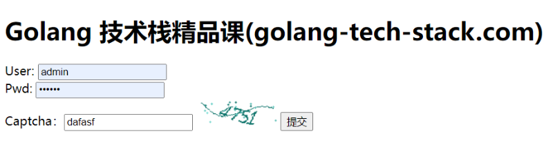

<!--
 * @Author: ChenLong longchen2008@126.com
 * @Date: 2022-06-04 22:48:34
 * @LastEditors: ChenLong longchen2008@126.com
 * @LastEditTime: 2022-06-04 22:59:46
 * @FilePath: \study\03_golang_tech_stack\special\captcha\readme.md
 * @Description: 这是默认设置,请设置`customMade`, 打开koroFileHeader查看配置 进行设置: https://github.com/OBKoro1/koro1FileHeader/wiki/%E9%85%8D%E7%BD%AE
-->
# Golang验证码

gin实现验证码

## 知识结构

- gin
- session中间件
- 表单处理
- 路由

## 下载包

```bash
go get github.com/dchest/captcha
```

## 导包

```bash
import (
    "bytes"
    "net/http"
    "time"
    "github.com/dchest/captcha"
    "github.com/gin-contrib/sessions"
    "github.com/gin-contrib/sessions/cookie"
    "github.com/gin-gonic/gin"
)
```

## 配置session

```bash
func SessionConfig() sessions.Store {
    sessionMaxAge := 3600
    sessionSecret := "golang-tech-stack"
    store := cookie.NewStore([]byte(sessionSecret))
    store.Options(sessions.Options{
        MaxAge: sessionMaxAge, //seconds
        Path:   "/",
    })
    return store
}
```

## 中间件，处理session

```bash
// 中间件，处理session
func Session(keyPairs string) gin.HandlerFunc {
    store := SessionConfig()
    return sessions.Sessions(keyPairs, store)
}
```

## 生成图片

```bash
// 生成图片
func Serve(w http.ResponseWriter, r *http.Request, id, ext, lang string, download bool, width, height int) error {
    w.Header().Set("Cache-Control", "no-cache, no-store, must-revalidate")
    w.Header().Set("Pragma", "no-cache")
    w.Header().Set("Expires", "0")

    var content bytes.Buffer
    switch ext {
    case ".png":
        w.Header().Set("Content-Type", "image/png")
        _ = captcha.WriteImage(&content, id, width, height)
    case ".wav":
        w.Header().Set("Content-Type", "audio/x-wav")
        _ = captcha.WriteAudio(&content, id, lang)
    default:
        return captcha.ErrNotFound
    }

    if download {
        w.Header().Set("Content-Type", "application/octet-stream")
    }
    http.ServeContent(w, r, id+ext, time.Time{}, bytes.NewReader(content.Bytes()))
    return nil
}
```

```bash
// 生成验证码
func Captcha(c *gin.Context, length ...int) {
    l := captcha.DefaultLen
    w, h := 107, 36
    if len(length) == 1 {
        l = length[0]
    }
    if len(length) == 2 {
        w = length[1]
    }
    if len(length) == 3 {
        h = length[2]
    }
    captchaId := captcha.NewLen(l)
    session := sessions.Default(c)
    session.Set("captcha", captchaId)
    _ = session.Save()
    _ = Serve(c.Writer, c.Request, captchaId, ".png", "zh", false, w, h)
}
```

## 验证

```bash
func CaptchaVerify(c *gin.Context, code string) bool {
    session := sessions.Default(c)
    if captchaId := session.Get("captcha"); captchaId != nil {
        session.Delete("captcha")
        _ = session.Save()
        if captcha.VerifyString(captchaId.(string), code) {
            return true
        } else {
            return false
        }
    } else {
        return false
    }
}
```

## 前端页面

```bash
<!DOCTYPE html>
<html lang="en">
<head>
    <meta charset="UTF-8">
    <title>Golang 技术栈精品课(golang-tech-stack.com)验证码</title>
</head>
<body>


<h1>Golang 技术栈精品课(golang-tech-stack.com)</h1>

<form action="/captcha/verify/" method="post">

    User: <input type="text"> <br>
    Pwd: <input type="password"> <br>
    Captcha：<input type="text" name="code"> 

    

    <input type="submit">
</form>
</body>
</html>
```

## 测试

```bash
// 测试
func main() {
    router := gin.Default()
    router.LoadHTMLGlob("./*.html")
    router.Use(Session("golang-tech-stack"))
    router.GET("/captcha", func(c *gin.Context) {
        Captcha(c, 4)
    })
    router.GET("/", func(c *gin.Context) {
        c.HTML(http.StatusOK, "index.html", nil)
    })
    router.POST("/captcha/verify/", func(c *gin.Context) {
        value := c.PostForm("code")
        if CaptchaVerify(c, value) {
            c.JSON(http.StatusOK, gin.H{"status": 0, "msg": "success"})
        } else {
            c.JSON(http.StatusOK, gin.H{"status": 1, "msg": "failed"})
        }
    })
    router.Run(":8080")

    // http://localhost:8080/

}
```

## 运行

```bash
http://localhost:8080/
```

## 运行结果


